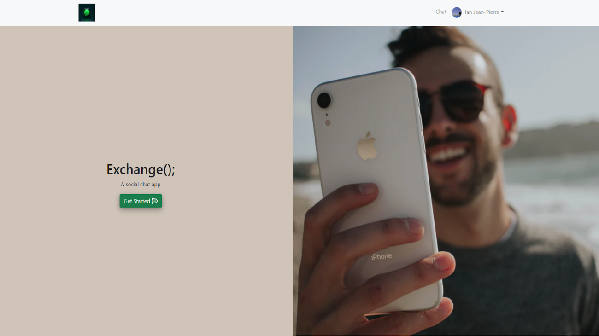

# MERN Stack Single Chat App: Exchange(); 📲

## Concept 📝
This full stack MERN chat app is an application designed to connect users with new people across the globe with similar interests, whether it's general chat, sports, crypto or anything that's on your mind. Your new friends are just a click away, waiting for you! 🚀

## Table of Contents 📋
### [Installation](#installation)
### [Usage](#usage) 
### [License](#license) 
### [Contributions](#contributions) 
### [Questions](#questions) 

---

## Technologies Used 💻
This web app uses [MongoDB](https://www.mongodb.com/), [Mongoose ODM](https://www.mongodb.com/), [Express.js](https://expressjs.com/), [React.js](https://reactjs.org/), [Node.js](https://nodejs.org/en/), and [Socket.IO](https://socket.io/).

To install and run, open the code in VS Code. 

- **[GitHub Repository](https://github.com/woodstr3313/project-chat-app)**
- **[GitHub Deployment](https://itsbrianfire.github.io/mern-stack-exchange-chat-app/)**
- **[Heroku deployment](https://mern-stack-exchange-chat-app.herokuapp.com/)**

---

## Usage
Upon using this app, You will be able to create a user, login to the app, navigate to the app's different chat rooms, and chat with fellow users on the app. Run the MERN stack app and navigate the site **[here](https://itsbrianfire.github.io/mern-stack-exchange-chat-app/)**.

### **Future Developments**
In the future we intend to:
- Add a location setting so the app can show locals to chat with. 
- Include personal information settings to show common interests, personality types, and favorite activities.
- Update and Delete personal profiles.
- Expanding the application to serve as a chat/ matchmaking application.

---

## License

**MIT:** https://opensource.org/licenses/MIT - The MIT License is a permissive free software license originating at the Massachusetts Institute of Technology (MIT) in the late 1980s. As a permissive license, it puts only very limited restriction on reuse and has, therefore, high license compatibility.

---

## Contributions 👥
This MERN Stack Single Chat App was made in collaboration between:
- [Travis Woods](https://github.com/woodstr3313/)
- [Hannah Culver-Zawislak](https://github.com/hculv/)
- [Brian Garcia](https://github.com/itsbrianfire/)
- [Ian Jean-Pierre](https://github.com/HotelYankee)

---

## Questions 👋
Questions or comments about the project? Feel free to reach us to any of the contributers listed above.

Happy Coding!
